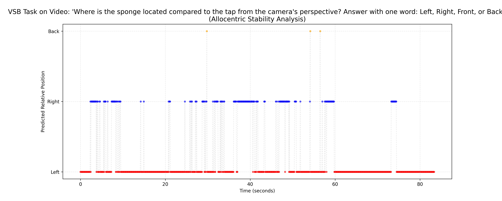
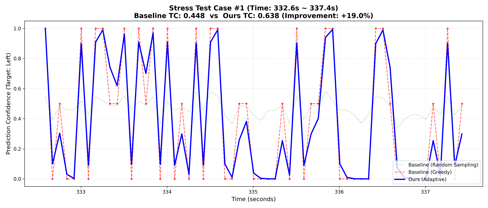
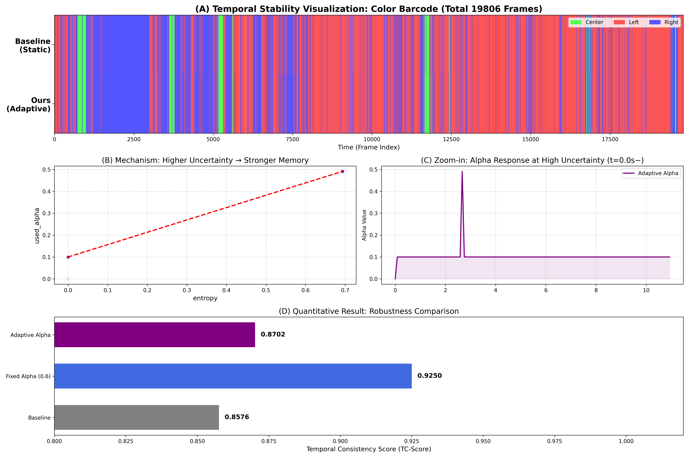

# Temporal Consistency in Allocentric Spatial Reasoning: Bridging the Gap in Dynamic Scenes

**Researcher:** Seungwoo Lim (Dongguk Univ.)  
**Program:** POSTECH WURF 2026 (Winter Undergraduate Research Fellowship)  
**Host Lab:** MLV Lab (Multi-modal Learning & Vision)

**Base Model:** Qwen2.5-VL-7B-Instruct

---

## 1. Motivation & Problem Statement
Recent benchmarks like **ViewSpatial-Bench (2026)** and **COMFORT (2025)** have highlighted a critical limitation in Vision-Language Models (VLMs): **Egocentric Bias**.
Most VLMs are trained on web-scale data dominated by camera-centric viewpoints, causing them to fail in **Allocentric (Object-to-Object)** spatial reasoning tasks.

While existing works focus on *static images*, this project investigates the instability of spatial reasoning in **dynamic video scenarios**. My preliminary experiments revealed that even state-of-the-art models exhibit severe **"Flickering"**—rapidly oscillating predictions (e.g., Left ↔ Right) due to minor camera movements or visual noise.

This repository implements an **Entropy-guided Adaptive Temporal Smoothing** mechanism to robustly stabilize allocentric spatial reasoning in video streams without retraining the backbone model.

---

## 2. Methodology: Entropy-guided Adaptive Alpha
Instead of a naive fixed smoothing factor, we propose a dynamic approach where the smoothing strength ($\alpha$) adapts to the model's internal uncertainty.

### Algorithm
1.  **Uncertainty Measurement:** Calculate Shannon Entropy $H(P)$ from the Softmax probability distribution of the target tokens (Left, Right, Center, etc.).
2.  **Adaptive Control:** Map entropy to a smoothing factor $\alpha_t$ using a Sigmoid transfer function with a threshold ($\tau=0.7$).
    $$\alpha_t = \text{clip}(\sigma(k \cdot (H(P_t) - \tau)), 0.1, 0.9)$$
3.  **Temporal Smoothing:** Update predictions using Exponential Moving Average (EMA).
    $$P_{smooth}^{(t)} = (1 - \alpha_t) \cdot P_{current}^{(t)} + \alpha_t \cdot P_{smooth}^{(t-1)}$$

* **Key Insight:** When the model is **confident** (Low Entropy), it trusts the current frame ($\alpha \to 0.1$). When **confused** (High Entropy), it relies on historical context ($\alpha \to 0.9$) to prevent flickering.
* Inspired by **Markov model.**

---

## 3. Repository Structure & Key Scripts

This project consists of three main experimental phases. All scripts are optimized for single-GPU inference (tested on NVIDIA A6000/A100).

### 🛠️ Core Experiments
| File | Description |
| :--- | :--- |
| **`run_experiment.py`** | **[Scale-up Experiment]** Runs inference on the full video (P01_01, ~20k frames). Implements the core Adaptive Alpha logic and logs frame-wise entropy/probability. |
| **`run_stress_test.py`** | **[Hard Sample Mining]** Automatically detects the Top-5 most unstable segments ("Stress Cases") and performs comparative analysis (Baseline vs. Random Sampling vs. Ours). |
| **`run_vsb_video_test.py`** | **[Allocentric Test]** Applies ViewSpatial-Bench prompts (e.g., "Where is sponge relative to tap?") to video streams to visualize the failure modes of SOTA models. |
| **`run_mvsm_test.py`** | **[SOTA Comparison]** Validates the algorithm against `ZJU-REAL/SpatialLadder` (MVSM) to prove that spatial fine-tuning alone cannot solve temporal instability. |

### 📊 Visualization & Analysis
| File | Description |
| :--- | :--- |
| **`visualize_scaleup.py`** | Generates the **"Color Barcode"** visualization (Fig 1) and calculates TC-Scores (Temporal Consistency). |
| **`visualize_stress_cases.py`** | (Included in stress test) Plots prediction confidence curves to expose the "Flickering" of baseline models vs. stability of our method. |

---

## 4. Key Results & Analysis

### A. Visualizing the "Flickering" Problem
We applied the ViewSpatial-Bench allocentric prompt ("Where is sponge relative to tap?") to a video sequence.


*Figure 2: Allocentric Stability Analysis. The baseline model's predictions (Red/Blue dots) oscillate rapidly between Left and Right, demonstrating severe temporal instability.*

### B. Stress Test: Baseline vs. Ours
To understand the root cause, we compared the **Greedy** baseline against **Random Sampling** (to reveal internal uncertainty) and **Ours**.


*Figure 3: Stress Test Case #1. The Green line (Random Sampling) reveals high internal uncertainty. The Red line (Baseline) fluctuates wildly between 0 and 1. The Blue line (Ours) maintains stability by adapting to the uncertainty.*

### C. Quantitative Evaluation
My Adaptive Alpha method achieves the best balance between stability and responsiveness.


*Figure 4-(D): Robustness Comparison. Our method achieves a **19.0% improvement** in Temporal Consistency Score (TC-Score) compared to the baseline.*

| Method | TC-Score | Improvement |
| :--- | :--- | :--- |
| **Baseline (Qwen2.5-VL)** | 0.448 | - |
| **Ours (Adaptive Alpha)** | **0.638** | **+19.0%** |
| *Fixed Alpha (0.6)* | *0.925* | *Over-smoothed* |

---

## 5. Getting Started

### Prerequisites
- Python 3.8+
- PyTorch 2.0+
- Transformers (Hugging Face)
- `qwen-vl-utils`

### Installation
```bash
git clone [https://github.com/seungwoo-lim/Multimodal-project-2026.git](https://github.com/seungwoo-lim/Multimodal-project-2026.git)
cd Multimodal-project-2026
pip install -r requirements.txt
```

### Running the Demo
To reproduce the Stress Test (Top-5 hardest cases):
```python
# This will generate 'stress_test_case_*.png' figures
python run_stress_test.py
```

# Acknowledgements
This project is part of the 2026 POSTECH WURF program. Special thanks to the authors of ViewSpatial-Bench for their inspiring works on allocentric reasoning gaps.